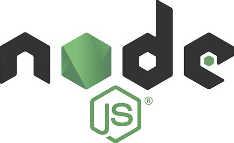

# Masterthesis

The master thesis project focuses on developing a Model-Driven approach for creating a plugin for Visual Studio Code. This plugin aims to interface with a recommender system via its API, in order to provide suggestions to users during software development. The project explores the potential of combining Model-Driven Engineering (MDE) techniques with modern development platforms and recommender systems.

## Technologies Used

Below are the key technologies used in the project:

<table>
  <tr>
    <td align="center">
       
      <b>Acceleo</b> 
      A model-driven code generator based on EMF.
    </td>
    <td align="center">
       
      <b>Eclipse Modeling Framework (EMF)</b> 
      A modeling and code generation platform.
    </td>
    <td align="center">
       
      <b>Node.js</b> 
      A server-side JavaScript runtime used to develop the VSCode plugin.
    </td>
  </tr>
</table>

## Project Workflow

1. **Requirements Analysis:** Identification of the functional and non-functional requirements of the plugin.
2. **Model Definition:** Creation of a high-level model using EMF.
3. **Code Generation:** Use of Acceleo to generate the source code of the plugin.
4. **Plugin Development:** Implementation of missing functionalities and integration with the recommender system.
5. **Testing and Optimization:** Verification of the plugin functionality and optimization based on user feedback.

For further details, please refer to the complete documentation included in the repository.
